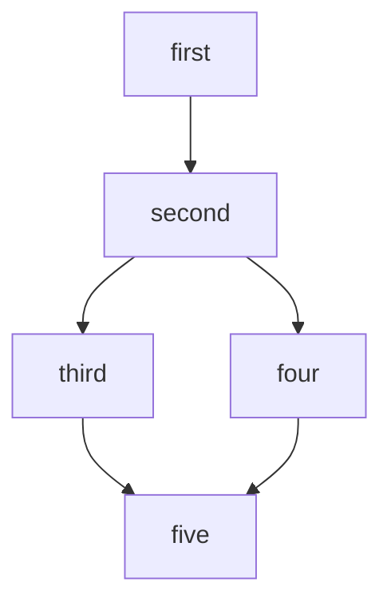

この記事は[CureApp Advent Calendar 2024](https://qiita.com/advent-calendar/2024/cureapp) 9日目の記事です。
CommonJSとESModulesの話をしますが、これらがなにかについては他の記事の解説に譲ることにします。  

# はじめに

この記事では、様々な事情からどうしてもCommonJSからESModulesを同期的に呼び出さないといけない時のやり方を解説します。  
JavaScriptには大きくわけてCommonJSとESModulesという2つのモジュールシステムがあります。  
2024年12月3日、ついに[Node.js v22.12.0](https://nodejs.org/en/blog/release/v22.12.0)でCommonJSからESModulesを呼び出すことがデフォルトで可能になりました。  

今までの2つのモジュールシステムの大きな特徴として、ESModulesからCommonJSを呼び出す（import）ことはできるが、CommonJSからESModulesを呼び出す（require）ことはできませんでした。  
2つのモジュールシステムの関係性は、ESModulesを主語とした場合共存することはできますが、CommonJSを主語とした場合共存することができません。  

この常識はこれから変わっていきますが、この記事ではNode.js v22.12.0以前をターゲットとした話になります。


## CommonJSからESModulesを動かす方法

限定的ではありますが、いくつかの方法でCommonJSからESModulesを呼び出すことは昔から可能です。  
最も有名な方法がdynamic importを使うやり方です。  

```js
// main.cjs
function loadBar() {
  import('./bar.mjs')
    .then((bar) => {
      // なにか処理
    })
}
```

当然ですが、動的に呼び出してやりたいことが実現できる場合のみに活用できる方法になります。  
通常のモジュール読み込みと同じようにファイルの先頭で呼び出したい場合、別の手段をとる必要があります。  
それがESModulesをCommonJSにトランスパイルすることです。

:::message alert
ESModulesをCommonJSにトランスパイルして動かすことは一般的には推奨できません。  
そのライブラリーがESModulesで動かすことを前提としている場合、CommonJSにトランスパイルして動く保証はありません。  
まずは「その前にできること」のセクションで取ることができる手段をとるべきです。  
この記事で解説するやり方は、飽くまでも最終手段としてご活用ください。
:::

### その前にできること

具体的な話に入る前に、自プロダクトで使おうとしているライブラリーがESModulesでしか動かない場合、まずは他の手段をとることができないかを考えましょう。  
CommonJSからESModulesに移行する場合、[Pure ESM package](https://gist.github.com/sindresorhus/a39789f98801d908bbc7ff3ecc99d99c)のドキュメントを一読するのがおすすめです。

- 自身のプロダクトをESModulesに移行する
  - ライブラリーとして配布する場合、最も推奨される手段
- CommonJSで動くバージョンがないか探してダウングレードする
- CommonJSでも動く別のライブラリーを探す

## まずはCommonJSでESModulesを呼び出してみる

ESModulesだけで動くライブラリーとして、mermaid-cliを一例に解説していきます。  
mermaid-cliはマークダウンからmermaidの記法を画像として出力するライブラリーです。  
例えば、下記のようなマークダウンファイルをmermaid-cliにわたすと、下記の画像を出力することができます。

```md
# Flowchart

sample flowchart




これをNode.js上でプログラマブルに実行しようとすると、だいたいこんな感じのコードになります。
このコードを実行すると、mermaid-cliから関数がexportされていないというエラーが出力されます。

```ts
const path = require("node:path");
const { run } = require("@mermaid-js/mermaid-cli");

async function main() {
  const input = path.join(process.cwd(), "src/flowchart.md");
  const output = path.join(process.cwd(), "src/flowchart.png");
  await run(input, output);
}

main();

```

```shell
npx tsx ./src/index.ts

node:internal/modules/esm/resolve:296
  return new ERR_PACKAGE_PATH_NOT_EXPORTED(
         ^

Error [ERR_PACKAGE_PATH_NOT_EXPORTED]: No "exports" main defined in /test/sample-esm-to-cjs/node_modules/@mermaid-js/mermaid-cli/package.json
    at exportsNotFound (node:internal/modules/esm/resolve:296:10)
    at packageExportsResolve (node:internal/modules/esm/resolve:586:13)
    at resolveExports (node:internal/modules/cjs/loader:640:36)
    at Function._findPath (node:internal/modules/cjs/loader:748:31)
    at node:internal/modules/cjs/loader:1235:27
    at nextResolveSimple (/test/sample-esm-to-cjs/node_modules/tsx/dist/register-DCnOAxY2.cjs:3:942)
    at /test/sample-esm-to-cjs/node_modules/tsx/dist/register-DCnOAxY2.cjs:2:2550
    at /test/sample-esm-to-cjs/node_modules/tsx/dist/register-DCnOAxY2.cjs:2:1624
    at resolveTsPaths (/test/sample-esm-to-cjs/node_modules/tsx/dist/register-DCnOAxY2.cjs:3:760)
    at /test/sample-esm-to-cjs/node_modules/tsx/dist/register-DCnOAxY2.cjs:3:1038 {
  code: 'ERR_PACKAGE_PATH_NOT_EXPORTED'
}
```

これ自体はmermaid-cliのpackage.jsonの設定によるもので、CommonJSからESModulesの呼び出しのエラーとはまた異なるエラーにはなりますが、広義では同じエラーと呼んでもいいでしょう。  
package.jsonに`"type": "module"`を追加したり、tsconfig.jsonの設定を変更したり、requireを`const { run } = require("@mermaid-js/mermaid-cli/src/index");`のようにすると、一応ローカルでは実行はできるようになります。  

力技で動かすことはできますが、最終的にビルドしたソースコードで`Error [ERR_REQUIRE_ESM]: require() of ES Module`というエラーにぶち当たり、詰みます。

### ERR_PACKAGE_PATH_NOT_EXPORTEDとは

なぜこのエラーが出力されるのかは、mermaid-cliのpackage.jsonを見るとわかります。  
該当部分だけを抜粋します。  
exportsフィールドは指定されていますが、importのみの指定でrequireへの指定が行われていません。  
なので、CommonJSのrequireで呼び出そうとしても相当するパスがないために、関数を見つけることができずに`ERR_PACKAGE_PATH_NOT_EXPORTED`が出力されるという流れです。  
CommonJSとESModulesの2つをサポートしているライブラリーの場合、exportsフィールド、あるいはmainフィールドにrequireへのパスが指定されています。  

```json
  "exports": {
    ".": {
      "import": {
        "types": "./dist-types/src/index.d.ts",
        "default": "./src/index.js"
      }
    }
  },
  "types": "./dist-types/src/index.d.ts",
```

tsconfig.jsonの設定次第で動くようになるのは、構文だけはimportに変わるためです。  
しかしtscでトランスパイルした後のコードではrequireに変わります（Fake ESModulesと呼ばれる所以です）。  
CommonJS、ESModulesが混在する現在の巨大なJavaScriptエコシステムで、ローカルでは動くがビルド後は動かなくなる原因の1つです。

```ts
// tsconfig.jsonで{"module": "CommonJS"}を指定していると、このimport文はtsc実行後にrequire文に変わる
import * as mermaidCli from "@mermaid-js/mermaid-cli";
```

## mermaid-cliをCommonJSにトランスパイルする

それでは、requireできるようにmermaid-cliをトランスパイルしていきましょう。  
今回はBabelを使ってトランスパイルします。

```shell
npm install @babel/cli @babel/core @babel/plugin-transform-modules-commonjs
```

```js
// babel.config.js
module.exports = {
  plugins: ['@babel/plugin-transform-modules-commonjs'],
};
```

```json
// package.json
{
  "scripts": {
    "mermaid-esm-to-cjs": "rm -rf ./src/mermaid-cli && npm run mermaid:cp && npm run mermaid:build",
    "mermaid:cp": "cp -r ./node_modules/@mermaid-js/mermaid-cli ./src/mermaid-cli",
    "mermaid:build": "babel ./src/mermaid-cli/src --out-file ./src/mermaid-cli/src/bundle.js"
  }
}
```

トランスパイルしたmermaid-cliはsrc直下にmermaid-cliというディレクトリーにbundle.jsとして配置しているので、requireをそのパスに変更します。  
今回はやりませんが、少し頑張ってスクリプトを組むとbundle.jsから読み込んだ関数に対しても型をつけることが可能です。

```diff
const path = require("node:path");
- const { run } = require("@mermaid-js/mermaid-cli");
+ const { run } = require("./mermaid-cli/src/bundle");
async function main() {
  const input = path.join(process.cwd(), "src/flowchart.md");
  const output = path.join(process.cwd(), "src/flowchart.png");
  await run(input, output);
}

main()
  .then(() => process.exit(0))
  .catch((e) => {
    console.error(e);
    process.exit(1);
  });

```

実行すると、mermaid-cliからフローチャートの図を出力することができるようになります。  

```shell
npx tsx ./src/index.ts

Found 1 mermaid charts in Markdown input
✅ ./flowchart-1.png
```

## ビルドしたソースコードを動かすためには

これまでの手順でCommonJSの環境下でローカルで動かすところまではできました。  
ローカルで動かすだけのスクリプトの場合、今回の対応で何とかなります。  
tscを実行すると、distディレクトリーにトランスパイルすることもできますが、これだけではまだ動かすことはできません。  

動かない原因はmermaid-cli特有の理由、ターゲットとする環境など様々な理由が絡んできます。  
ちなみに、今回作ったもの関してはNode.jsの18系、20系、22系でそれぞれ違うエラーがでてきます。  
import.meta.urlの参照、ESModulesがデフォルトになったなどなど...

もしライブラリーとしてパッケージとして配布する場合、素直にrollupやesbuildなどのモジュールバンドラーを使いましょう。  
あるいは、冒頭でも述べたようにESModulesへの移行を検討しましょう。

今回作成したものはサンプルとして[GitHub](https://github.com/cureapp/sample-esm-to-cjs)に公開しています。  
ビルドはできるようにしていますが、ビルドしたソースコードの実行はできませんので、ご注意ください。
